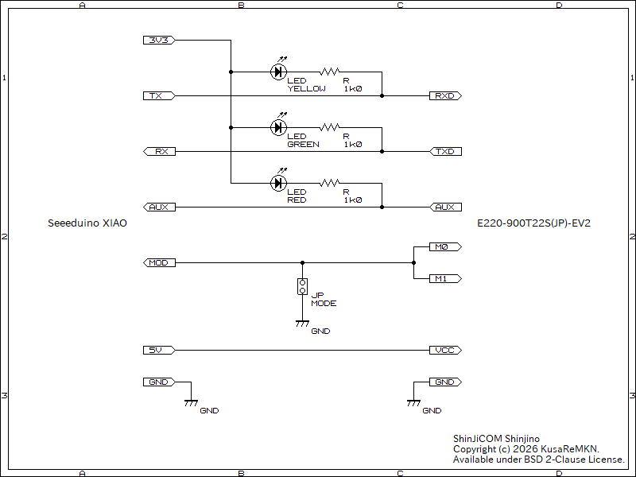

# Shinjino

## これはなに

PC に接続された Seeeduino XIAO（MCU）と E220-900T22S(JP)-EV2（通信モジュール）とで通信するプログラムです。通信モジュールの M0 及び M1 に印加される信号を監視することで、MCU と 通信モジュールとの間で、通信モジュールのモードに合わせたボーレートで通信できます。

## 用意するもの

- Seeeduino XIAO（秋月電子通商 販売コード: 115178）
- E220-900T22S(JP)-EV2（秋月電子通商 販売コード: 131361）

## 結線

| Seeeduino XIAO     | E220-900T22S |
| ------------------ | ------------ |
| GND                | GND          |
| 5V                 | VCC          |
| D1 (INPUT)         | AUX          |
| RX (D7)            | TXD          |
| TX (D6)            | RXD          |
| D2 (INPUT\_PULLUP) | M1, M0       |

### 回路図

下図のように結線すると、システムの動作状況を LED の点滅によって確認できます。また、ジャンパ端子をショートまたはオープンにすることによって、通信モジュールのモードを通常送受信モードまたはConfiguration/DeepSleep モードに設定できます。

## ライセンス

 BSD 2-Clause License
